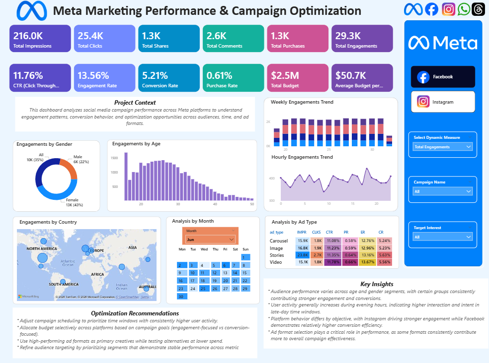
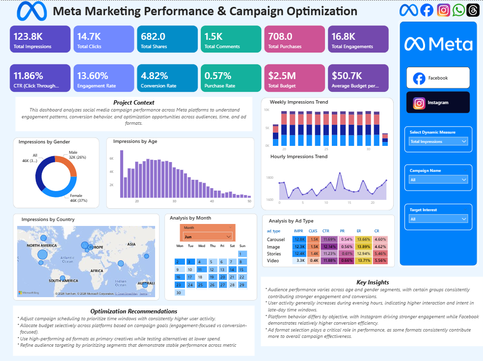

# Meta Marketing Performance & Campaign Optimization 📊

---

## 📌 Project Overview
This project presents an interactive Power BI dashboard built to analyze paid advertising performance across **Meta platforms (Facebook and Instagram)**.  
The dashboard enables dynamic exploration of key marketing metrics to understand audience behavior, time-based activity patterns, and ad format effectiveness, supporting data-driven campaign optimization decisions.

---

## 🎯 Business Objectives
- Evaluate campaign performance across Facebook and Instagram
- Identify audience segments driving higher engagement and conversions
- Analyze time-based trends to optimize ad scheduling
- Compare ad format effectiveness across platforms
- Support strategic marketing and budget allocation decisions

---

## ⭐ Key Features
- Dynamic KPI selection (Impressions, Clicks, Engagements, Purchases)
- Platform-level analysis (Facebook vs Instagram)
- Audience segmentation by age and gender
- Hourly and weekly performance trend analysis
- Calendar heatmap with KPI tooltip for day-level insights
- Ad format performance comparison
- Embedded insights and optimization recommendations

---

## 📈 KPIs Tracked
- Total Impressions
- Total Clicks
- Total Engagements
- Total Shares
- Total Comments
- Total Purchases
- Click Through Rate (CTR)
- Engagement Rate
- Conversion Rate
- Purchase Rate
- Total Campaign Budget
- Average Budget per Campaign 

---

## 🛠️ Tools & Technologies
- Power BI  
- DAX  
- Power Query  
- CSV datasets  

---

## 📸 Dashboard Preview

### Facebook Performance View

### Instagram Performance View

---

## 🔍 Insights Summary
- Audience engagement and conversion patterns vary across age and gender segments, with specific cohorts consistently contributing higher value.
- User activity demonstrates clear time-of-day trends, with stronger interaction during evening hours.
- Platform behavior differs by campaign objective, where Instagram drives higher engagement while Facebook shows relatively stronger conversion efficiency.
- Ad format selection plays a significant role in overall campaign effectiveness.

---

## 🚀 Optimization Recommendations
- Schedule campaigns around high-activity time windows to improve engagement and conversion efficiency.
- Allocate budgets selectively based on campaign goals (engagement-focused vs conversion-focused).
- Prioritize high-performing ad formats while testing alternatives with controlled spend.
- Focus targeting efforts on audience segments demonstrating stable performance across metrics.

---

## 📂 Files in This Repository
- [Power BI Report (.pbit)](Meta Marketing Performance& Campaign Optimization.pbit) – Power BI report file  
- [Dashboard PDF](Meta%20Marketing%20Performance&%20Campaign%20Optimization.pdf) – Exported dashboard for quick review  
- [Facebook Dashboard Screenshot](Page1_Facebook.png) – Facebook platform dashboard view  
- [Instagram Dashboard Screenshot](Page2_Instagram.png) – Instagram platform dashboard view  

---

## 📝 Notes
- Insights and recommendations are written at a pattern level to remain valid across dynamic metric selection.
- Facebook and Instagram pages represent filtered views of the same analytical model to ensure consistency and comparability.

